---
## Front matter
title: "Отчет по лабораторной работе 6"
subtitle: "Основы работы с Midnight Commander (mc). Структура программы на языке ассемблера NASM. Системные вызовы в ОС GNU Linux"
author: "Гисматуллин Артём Вадимович НПИбд-01-22"

## Generic otions
lang: ru-RU
toc-title: "Содержание"

## Bibliography
bibliography: bib/cite.bib
csl: pandoc/csl/gost-r-7-0-5-2008-numeric.csl

## Pdf output format
toc: true # Table of contents
toc-depth: 2
lof: true # List of figures
lot: true # List of tables
fontsize: 12pt
linestretch: 1.5
papersize: a4
documentclass: scrreprt
## I18n polyglossia
polyglossia-lang:
  name: russian
  options:
	- spelling=modern
	- babelshorthands=true
polyglossia-otherlangs:
  name: english
## I18n babel
babel-lang: russian
babel-otherlangs: english
## Fonts
mainfont: PT Serif
romanfont: PT Serif
sansfont: PT Sans
monofont: PT Mono
mainfontoptions: Ligatures=TeX
romanfontoptions: Ligatures=TeX
sansfontoptions: Ligatures=TeX,Scale=MatchLowercase
monofontoptions: Scale=MatchLowercase,Scale=0.9
## Biblatex
biblatex: true
biblio-style: "gost-numeric"
biblatexoptions:
  - parentracker=true
  - backend=biber
  - hyperref=auto
  - language=auto
  - autolang=other*
  - citestyle=gost-numeric
## Pandoc-crossref LaTeX customization
figureTitle: "Рис."
tableTitle: "Таблица"
listingTitle: "Листинг"
lofTitle: "Список иллюстраций"
lotTitle: "Список таблиц"
lolTitle: "Листинги"
## Misc options
indent: true
header-includes:
  - \usepackage{indentfirst}
  - \usepackage{float} # keep figures where there are in the text
  - \floatplacement{figure}{H} # keep figures where there are in the text
---

# Цель работы

Приобретение практических навыков работы в Midnight Commander. Освоение инструкций языка ассемблера mov и int.

# Задание

1. Создайте каталог для работы с программами на языке ассемблера NASM посредством Midnight Commander, создайте текстовый файл с названием lab6-1.asm и начните работу с ним.

2. Оттранлируйте ранее введеный текст программы lab6-1.asm, запустите его и проверьте работоспособность, введя ФИО.

3. Подключите внешний файл in_out.asm, создайте копию текстового файла lab6-1.asm под названием lab6-2.asm и используйте необходимые подпрограммы в соответствии с листингом.

4. В файле lab6-2.asm замените подпрограмму sprintLF на sprint. Создай-
те исполняемый файл и проверьте его работу. Объясните, в чем заключается разница.

5. Создайте копию файла lab6-1.asm. Внесите изменения в программу (без
использования внешнего файла in_out.asm) так, чтобы программа выводила введенную строку на экран.

6. Реализуйте аналогичную идею, только уже с использованием подпрограмм из файла in_out.asm, проверив работоспособность.

# Теоретическое введение

## Midnight Commander

Midnight Commander (или просто mc) — это программа, которая позволяет просматривать структуру каталогов и выполнять основные операции по управлению файловой системой, т.е. mc является файловым менеджером. Midnight Commander позволяет сделать работу с файлами более удобной и наглядной. Вызов данной программы осуществляется с помощью команды mc в командной строке. 

## Структура программы на языке ассемблера NASM

Программа на языке ассемблера NASM, как правило, состоит из трёх секций: секция кода программы (SECTION .text), секция инициированных (известных во время компиляции) данных (SECTION .data) и секция неинициализированных данных (тех, под которые во время компиляции только отводится память, а значение присваивается в ходе выполнения программы) (SECTION .bss).

Для объявления инициированных данных в секции .data используются директивы DB, DW, DD, DQ и DT, которые резервируют память и указывают, какие значения должны храниться в этой памяти.
Директивы используются для объявления простых переменных и для объявления массивов. Для определения строк принято использовать директиву DB в связи с особенностями хранения данных в оперативной памяти.

Синтаксис директив определения данных следующий:
	<имя> DB <операнд> [, <операнд>] [, <операнд>]
	
Для объявления неинициированных данных в секции .bss используются директивы resb, resw, resd и другие, которые сообщают ассемблеру, что необходимо зарезервировать заданное количество ячеек памяти.
## Элементы программирования

### Описание инструкции mov

Инструкция языка ассемблера mov предназначена для дублирования данных источника в приёмнике. В общем виде эта инструкция записывается в виде

mov dst,src

Здесь операнд dst — приёмник, а src — источник.
В качестве операнда могут выступать регистры (register), ячейки памяти (memory) и непосредственные значения (const). 

### Описание инструкции int.

Инструкция языка ассемблера int предназначена для вызова прерывания с указанным номером. В общем виде она записывается в виде:

int n

Здесь n — номер прерывания, принадлежащий диапазону 0–255.
При программировании в Linux с использованием вызовов ядра sys_calls n=80h (принято задавать в шестнадцатеричной системе счисления).
После вызова инструкции int 80h выполняется системный вызов какой-либо функции ядра Linux. При этом происходит передача управления ядру операционной системы. Чтобы узнать, какую именно системную функцию нужно выполнить, ядро извлекает номер системного вызова из регистра eax. Поэтому перед вызовом прерывания необходимо поместить в этот регистр нужный
номер. Кроме того, многим системным функциям требуется передавать какие-либо параметры. По принятым в ОС Linux правилам эти параметры помещаются в порядке следования в остальные регистры процессора: ebx, ecx, edx. Если системная функция должна вернуть значение, то она помещает его в регистр eax.

### Cистемные вызовы для обеспечения диалога с пользователем

Простейший диалог с пользователем требует наличия двух функций — вывода текста на экран и ввода текста с клавиатуры. Простейший способ вывести строку на экран — использовать системный вызов write. Этот системный вызов имеет номер 4, поэтому перед вызовом инструкции int необходимо поместить значение 4 в регистр eax. Первым аргументом write, помещаемым в регистр ebx, задаётся дескриптор файла. Для вывода на экран в качестве дескриптора файла нужно указать 1 (это означает «стандартный вывод», т. е. вывод на экран).

Вторым аргументом задаётся адрес выводимой строки (помещаем его в регистр ecx, например, инструкцией mov ecx, msg). Строка может иметь любую длину.
Последним аргументом (т.е. в регистре edx) должна задаваться максимальная длина выводимой строки.
Для ввода строки с клавиатуры можно использовать аналогичный системный вызов read. Его аргументы – такие же, как у вызова write, только для «чтения» с клавиатуры используется файловый дескриптор 0 (стандартный ввод).

Системный вызов exit является обязательным в конце любой программы на языке ассемблер. Для обозначения конца программы перед вызовом инструкции int 80h необходимо поместить в регистр еах значение 1, а в регистр ebx код завершения 0.

# Выполнение лабораторной работы

1. Открыли Midnight Commander с помощью команды mc, и перешли в каталог ~/work/arch-pc. (рис. [-@fig:001])

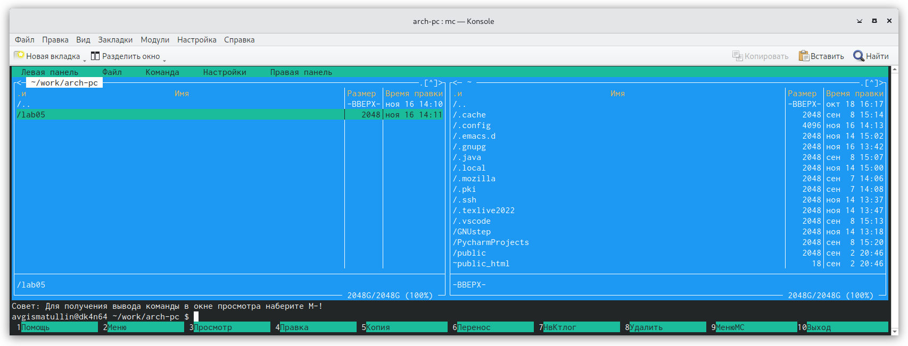{ #fig:001 width=70%, height=70% }

2. С помощью функциональной клавиши f7 создали папку lab06 в данном каталоге. (рис. [-@fig:002])

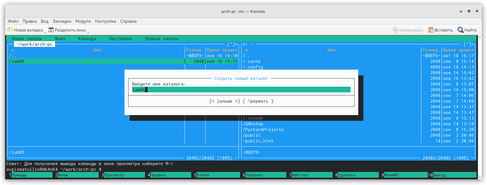{ #fig:002 width=70%, height=70% }

3. Создали в папке lab06 файл lab6-1.asm с помощью командной строки. (рис. [-@fig:003])

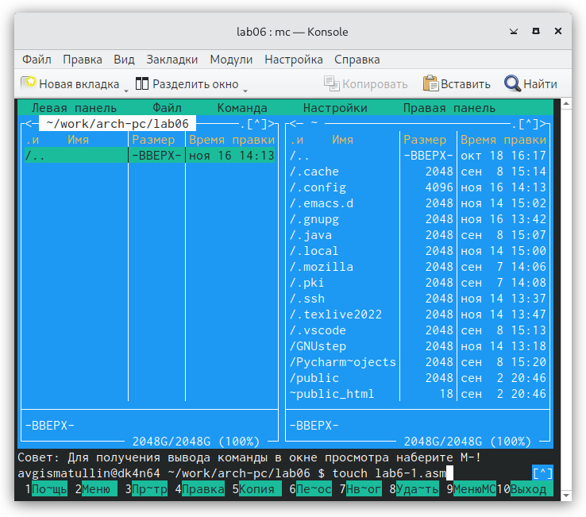{ #fig:003 width=70%, height=70% }

4. Открыли с помощью mc (функциональная клафиша f4) lab6-1.asm и внесли туда данные с листинга. (рис. [-@fig:004]) Убедились, что файл содержит изменения (функциональная клавиша f3) (рис. [-@fig:005])

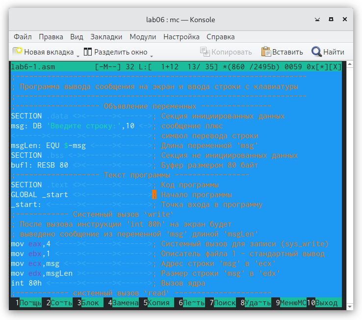{ #fig:004 width=70%, height=70% }

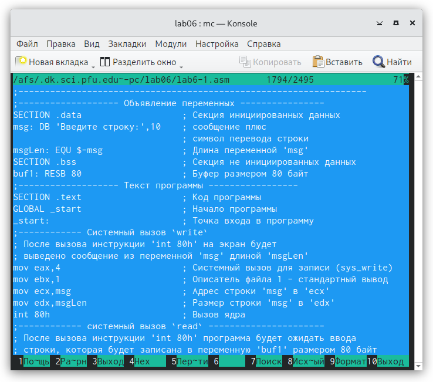{ #fig:005 width=70%, height=70% }

5. Провели оттрансляцию lab6-1.asm, выполнили компоновку получившегося объекного файла, а затем запустили его, проверив работоспособность. (рис. [-@fig:006])

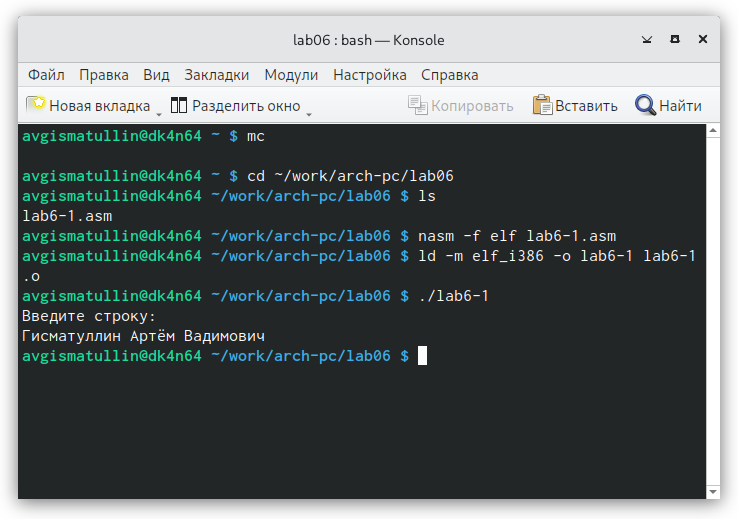{ #fig:006 width=70%, height=70% }

6. Предварительно скачав файл in_out.asm, скопировали его в каталог с файлом lab6-1.asm посредством mc. (рис. [-@fig:007]). Проверили наличие его в каталоге. (рис. [-@fig:008])

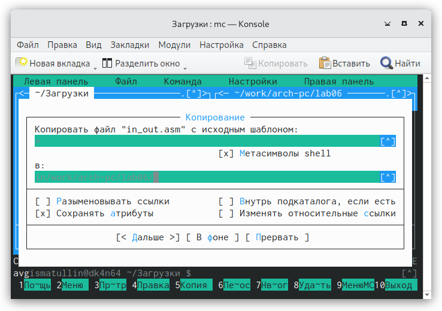{ #fig:007 width=70%, height=70% }

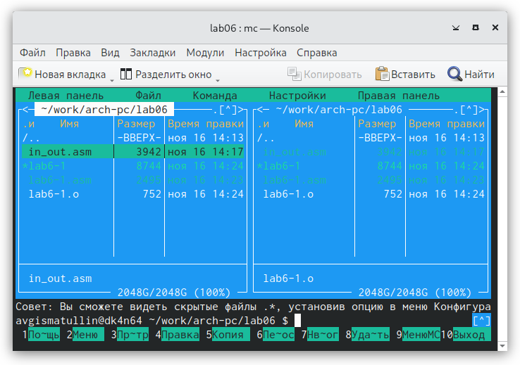{ #fig:008 width=70%, height=70% }

7. Копирование файла lab6-1.asm с помощью горячей клавиши F5.Получившийся файл имеет название lab6-2.asm. (рис. [-@fig:009])

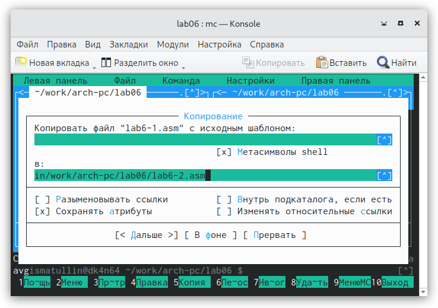{ #fig:009 width=70%, height=70% }

8. Проведя изменения в соответствии с листингом (подключение файла in_out.asm), проверили работоспособность файла la6-2.asm. (рис. [-@fig:010])

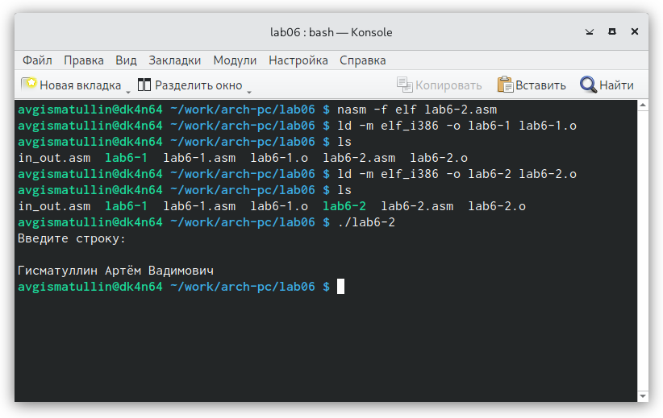{ #fig:010 width=70%, height=70% }

9. Открыв файл lab6-2.asm с помощью редактора mcedit (рис. [-@fig:011]), заменяем подпрограмму sprintLF на sprint. Смотрим результат. (рис. [-@fig:012])

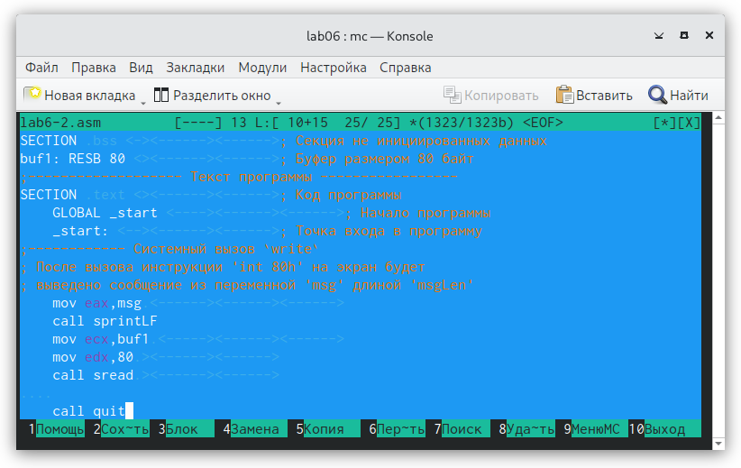{ #fig:011 width=70%, height=70% }

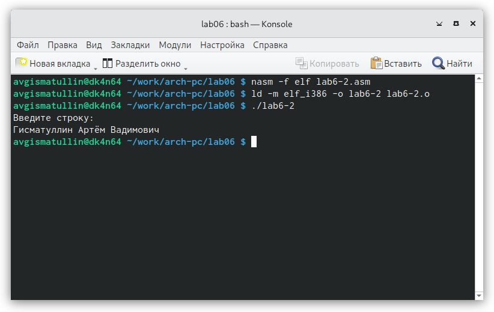{ #fig:012 width=70%, height=70% }

Разница вполне очевидна: sprintLF – работает аналогично sprint, но при выводе на экран добавляет к сообщению символ перевода строки, поэтому во втором случае отсутствует лишний пробел после строки.

# Выполнение заданий для самостоятельной работы

Суть самостоятельной работы заключается в том, чтобы изменить два вида решения (представленные файлами lab6-1.asm и lab6-2.asm),
где один из них использует подпрограммы файла int_out.asm, а другой - нет. А изменение решения будет заключаться в том, 
что мы в процессе выполнения программы будем выводить тот текст, который решили ввести мгновение назад (в ходе выполнения основной части мы вводили ФИО).
Для этого создадим копии файлов lab6-1.asm и lab6-2.asm, которые будут лежать в файлах lab6-3.asm и lab6-4.asm соответственно. 
Переходим к редактированию и проверке полученных результатов:

1. Редактируем файл lab6-3.asm без использования подпрограмм файла in_out.asm так, чтобы программа впоследствии выводила введенный ранее текст. Решение: (рис. [-@fig:013])

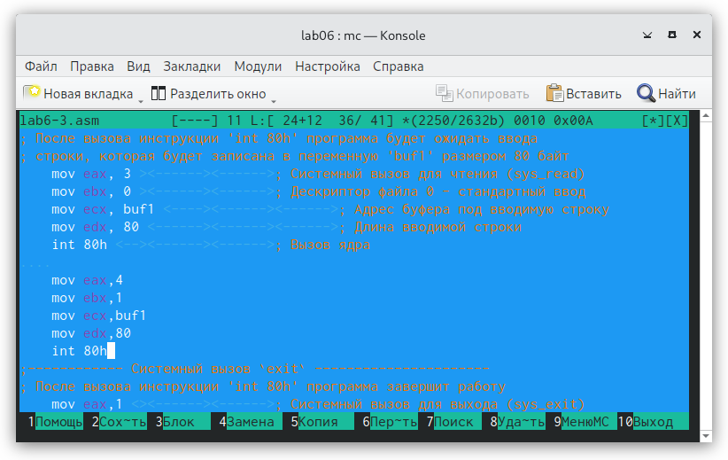{ #fig:013 width=70%, height=70% }

Проверка работоспособности: (рис. [-@fig:014])

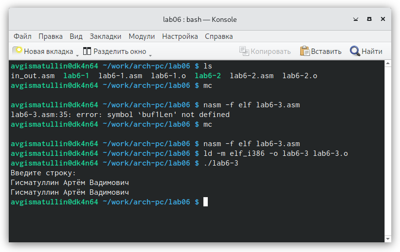{ #fig:014 width=70%, height=70% }

2. Теперь переходим к редактированию файла lab6-4.asm с реализацией той же идеи, только уже с использованием подпрограмм файла in_out.asm. Решение: (рис. [-@fig:015])

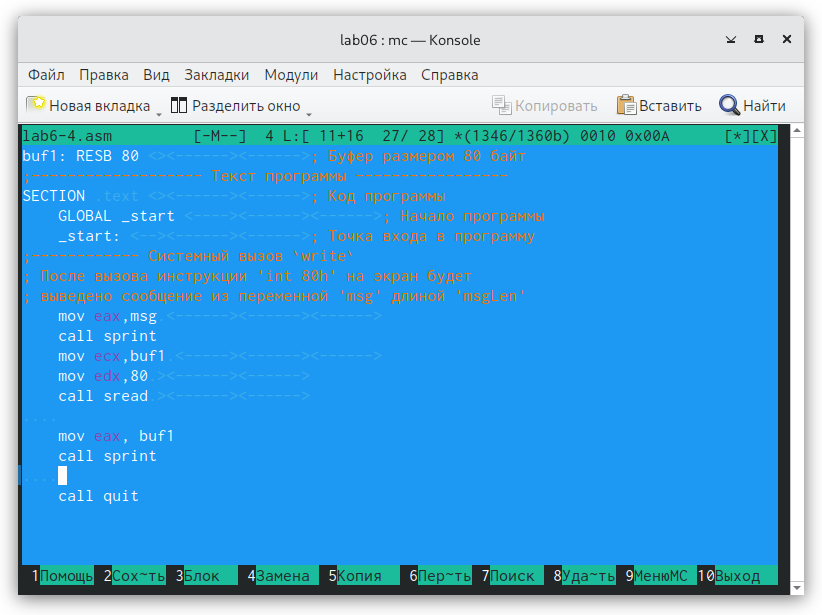{ #fig:015 width=70%, height=70% }

Проверка работоспособности: (рис. [-@fig:016])

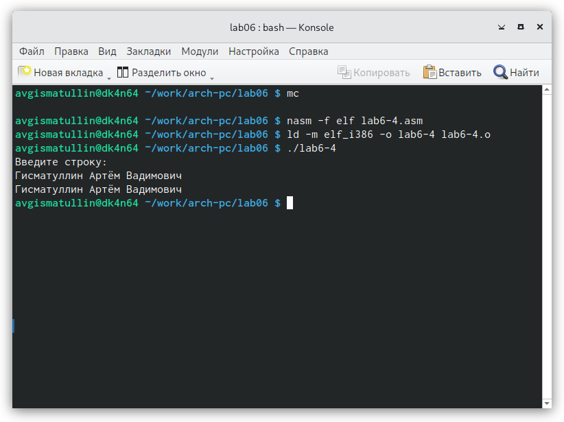{ #fig:016 width=70%, height=70% }

# Выводы

В ходе работы я успешно приобрел практические навыки работы в Midnight Commander,а также освоил инструкции языка ассемблера mov и int.

# Список литературы{.unnumbered}

::: {#refs}
:::
