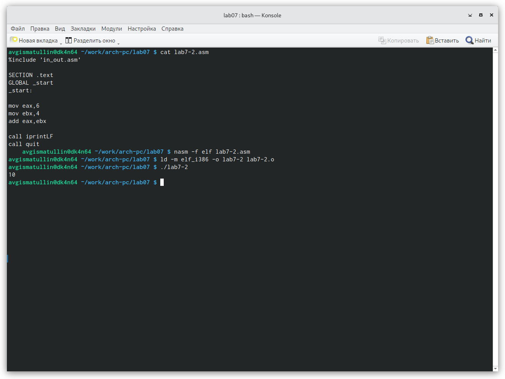

---
## Front matter
title: "Отчет по лабораторной работе 7"
subtitle: "Арифметические операции в NASM"
author: "Гисматуллин Артём Вадимович НПИбд-01-22"

## Generic otions
lang: ru-RU
toc-title: "Содержание"

## Bibliography
bibliography: bib/cite.bib
csl: pandoc/csl/gost-r-7-0-5-2008-numeric.csl

## Pdf output format
toc: true # Table of contents
toc-depth: 2
lof: true # List of figures
lot: true # List of tables
fontsize: 12pt
linestretch: 1.5
papersize: a4
documentclass: scrreprt
## I18n polyglossia
polyglossia-lang:
  name: russian
  options:
	- spelling=modern
	- babelshorthands=true
polyglossia-otherlangs:
  name: english
## I18n babel
babel-lang: russian
babel-otherlangs: english
## Fonts
mainfont: PT Serif
romanfont: PT Serif
sansfont: PT Sans
monofont: PT Mono
mainfontoptions: Ligatures=TeX
romanfontoptions: Ligatures=TeX
sansfontoptions: Ligatures=TeX,Scale=MatchLowercase
monofontoptions: Scale=MatchLowercase,Scale=0.9
## Biblatex
biblatex: true
biblio-style: "gost-numeric"
biblatexoptions:
  - parentracker=true
  - backend=biber
  - hyperref=auto
  - language=auto
  - autolang=other*
  - citestyle=gost-numeric
## Pandoc-crossref LaTeX customization
figureTitle: "Рис."
tableTitle: "Таблица"
listingTitle: "Листинг"
lofTitle: "Список иллюстраций"
lotTitle: "Список таблиц"
lolTitle: "Листинги"
## Misc options
indent: true
header-includes:
  - \usepackage{indentfirst}
  - \usepackage{float} # keep figures where there are in the text
  - \floatplacement{figure}{H} # keep figures where there are in the text
---

# Цель работы

Освоение арифметических инструкций языка ассемблера NASM.

# Задание

1. Рассмотреть примеры программ вывода символьных и численых значений (программы lab7-1.asm и lab7-2.asm).

2. Выполнить некоторые арифметические операции в NASM, вычислить несколько арифметических выражений (программа lab7-3.asm).

3. Вычислить вариант выражения по своему номеру студенческого билета по определенному алгоритму (программа variant.asm).

4. Ответить на вопросы.

5. Вычислить арифметическое выражение, вариантом которого является результат выполнения алгоритма по номеру студенческого билета.

# Теоретическое введение

## Адресация в NASM
Большинство инструкций на языке ассемблера требуют обработки операндов.
Адрес операнда предоставляет место, где хранятся данные, подлежащие обработке. Это могут быть данные хранящиеся в регистре или в ячейке памяти.

Существует три основных способа адресации:

1. Регистровая адресация – операнды хранятся в регистрах и в команде
используются имена этих регистров, например: mov ax,bx.
2. Непосредственная адресация – значение операнда задается непосред-
ственно в команде, Например: mov ax,2.
3. Адресация памяти – операнд задает адрес в памяти. В команде указывает-
ся символическое обозначение ячейки памяти, над содержимым которой
требуется выполнить операцию.

Например, определим переменную intg DD 3 – это означает, что задается область памяти размером 4 байта,
адрес которой обозначен меткой intg. В таком случае, команда mov eax,[intg] копирует из памяти по адресу intg данные в регистр eax.
В свою очередь команда mov [intg],eax запишет в память по адресу intg данные из регистра eax.

Также рассмотрим команду mov eax,intg

В этом случае в регистр eax запишется адрес intg. Допустим, для intg выделена память начиная с ячейки с адресом 0x600144, тогда команда mov eax,intg
аналогична команде mov eax,0x600144 – т.е. эта команда запишет в регистр eax число 0x600144.

## Арифметические операции в NASM

### Целочисленное сложение add.

Схема команды целочисленного сложения add выполняет сложение двух операндов и записывает результат по адресу первого операнда.
Команда add работает как с числами со знаком, так и без знака и выглядит следующим образом:
add <операнд_1>, <операнд_2>

Допустимые сочетания операндов для команды add аналогичны сочетаниям
операндов для команды mov.
Так, например, команда add eax,ebx прибавит значение из регистра eax к
значению из регистра ebx и запишет результат в регистр eax.
Примеры:
add ax,5 ; AX = AX + 5
add dx,cx ; DX = DX + CX
add dx,cl ; Ошибка: разный размер операндов.

### Целочисленное вычитание sub.

Команда целочисленного вычитания sub работает аналогично команде add и выглядит следующим образом:
sub <операнд_1>, <операнд_2>
Так, например, команда sub ebx,5 уменьшает значение регистра ebx на 5 и
записывает результат в регистр ebx.

### Команды инкремента и декремента.

Довольно часто при написании программ встречается операция прибавления или вычитания единицы. Прибавление единицы называется инкрементом, а
вычитание — декрементом. Для этих операций существуют специальные команды: inc и dec, которые увеличивают
и уменьшают на 1 свой операнд.
Эти команды содержат один операнд и имеет следующий вид:
inc <операнд>
dec <операнд>
Операндом может быть регистр или ячейка памяти любого размера. Команды
инкремента и декремента выгодны тем, что они занимают меньше места, чем
соответствующие команды сложения и вычитания.

### Команда изменения знака операнда neg.

Еще одна команда, которую можно отнести к арифметическим командам это
команда изменения знака neg:

neg <операнд>

Команда neg рассматривает свой операнд как число со знаком и меняет знак
операнда на противоположный. Операндом может быть регистр или ячейка памяти любого размера.

mov ax,1 ; AX = 1
neg ax ; AX = -1

### Команды умножения mul и imul.
Умножение и деление, в отличии от сложения и вычитания, для знаковых и
беззнаковых чисел производиться по-разному, поэтому существуют различные команды.
Для беззнакового умножения используется команда mul, а для знакового - imul.

Для команд умножения один из сомножителей указывается в команде и должен находиться в регистре или в памяти, но не может быть непосредственным
операндом. Второй сомножитель в команде явно не указывается и должен находиться в регистре EAX,AX или AL, а результат помещается в регистры EDX:EAX,
DX:AX или AX, в зависимости от размера операнда.

### Команды деления div и idiv.

Для деления, как и для умножения, существует 2 команды div и idiv:

div - Беззнаковое деление,
idiv - Знаковое деление

В командах указывается только один операнд – делитель, который может
быть регистром или ячейкой памяти, но не может быть непосредственным
операндом. Местоположение делимого и результата для команд деления зависит
от размера делителя. Кроме того, так как в результате деления получается два
числа – частное и остаток, то эти числа помещаются в определённые регистры.

## Перевод символа числа в десятичную символьную запись

Ввод информации с клавиатуры и вывод её на экран осуществляется в символьном виде. Кодирование этой информации производится согласно кодовой
таблице символов ASCII. ASCII – сокращение от American Standard Code for Information Interchange (Американский стандартный код для обмена информа-
цией). Согласно стандарту ASCII каждый символ кодируется одним байтом.

Расширенная таблица ASCII состоит из двух частей. Первая (символы с кода-
ми 0-127) является универсальной, а вторая (коды 128-255) предназначена для специальных символов и букв национальных алфавитов 
и на компьютерах разных типов может меняться.

Среди инструкций NASM нет такой, которая выводит числа (не в символьном виде). Поэтому, например, чтобы вывести число,
надо предварительно преобразовать его цифры в ASCII-коды этих цифр и выводить на экран эти коды, а не само число. Если же выводить число на экран непосредственно, то экран
воспримет его не как число, а как последовательность ASCII-символов – каждый байт числа будет воспринят как один ASCII-символ – и выведет на экран эти
символы.

Аналогичная ситуация происходит и при вводе данных с клавиатуры. Введенные данные будут представлять собой символы, что сделает невозможным
получение корректного результата при выполнении над ними арифметических операций.

Для решения этой проблемы необходимо проводить преобразование ASCII
символов в числа и обратно.

Для выполнения лабораторных работ в файле in_out.asm реализованы под-
программы для преобразования ASCII символов в числа и обратно. Это:

1. iprint – вывод на экран чисел в формате ASCII, перед вызовом iprint в
регистр eax необходимо записать выводимое число (mov eax,<int>).

2. iprintLF – работает аналогично iprint, но при выводе на экран после
числа добавляет к символ перевода строки.

3. atoi – функция преобразует ascii-код символа в целое число и записает
результат в регистр eax, перед вызовом atoi в регистр eax необходимо
записать число (mov eax,<int>).

# Выполнение лабораторной работы

1. Перешли в каталог ~/work/arch-pc/lab07 и создали файл lab7-1.asm. (рис. [-@fig:001])

{ #fig:001 width=70%, height=70% }

2. Ввели в файл lab7-1.asm текст программы листинга, создали исполняемый файл и посмотрели результат программы. (рис. [-@fig:002])

{ #fig:002 width=70%, height=70% }

Далее изменили текст программы и вместо символов записали в регистры числа.Запустили исполняемый файл. (рис. [-@fig:003])

{ #fig:003 width=70%, height=70% }

Можно заметить, что символ LF,[символ перевода строки] (под 10 в таблице ASCII) не отображается (заметен только перевод строки).

3. Создали файл lab7-2.asm и ввели туда текст следующего листинга. Создали и запустили исполняемый файл. (рис. [-@fig:004])

{ #fig:004 width=70%, height=70% }

Изменили текст программы аналогично lab7-1.asm (вместо символов записали в регистры числа) и посмотрели результат. (рис. [-@fig:005])

{ #fig:005 width=70%, height=70% }

Проверили разницу команды call iprintLF и iprint. Из теоретической части прошлой лабораторной работы мы можем сделать вывод, что разница
будет заключаться в переводе на следующую строку, что наглядно видно на рисунке. (рис. [-@fig:006])

{ #fig:006 width=70%, height=70% }

4. После этого создаем новый файл lab7-3.asm для выполнения различных операций в NASM. Внимательно изучили программу для вычисления выражения
f(x) = (5 * 2 + 3) / 3. (рис. [-@fig:007])

{ #fig:007 width=70%, height=70% }

Изменяем текст программы так, чтоб она вычисляла результат выражения f(x) = (4 * 6 + 2) / 5. (рис. [-@fig:008])

{ #fig:008 width=70%, height=70% }

5. Следующим шагом будет высиление варианта задания по номеру студенеского билета. Для этого создаем файл variant.asm, 
изучаем алгоритм и выполняем соответствующую программу. (рис. [-@fig:009])

{ #fig:009 width=70%, height=70% }

Таким образом, наш вариант для выполнения самостоятельной работы под номером 11.

6. Ответы на вопросы:
	1. Какие строки листинга 7.4 отвечают за вывод на экран сообщения ‘Ваш вариант:’?
	
	Ответ:  mov eax, rem
		call sprint.
		
	2. Для чего используется следующие инструкции? nasm  mov ecx, x mov edx, 80 call sread
	
	Ответ: инструкция nasm необходима для трансляции программы файла с расширением .asm в объектный код (результат запишется в объектный файл с расш. .o).
	mov ecx, x - Адрес х под вводимую строку
	mov edx, 80 - Указание длины вводимой строки
	call sread - ввод сообщения с клавиатуры (до нее нужно указать, в какой регистр и какой длины сообщение инструкциями mov)
	
	3. Для чего используется инструкция “call atoi”?
	
	Ответ: call atoi - функция преобразует ascii-код символа в целое число и записывает результат в регистр eax.
	
	4. Какие строки листинга 7.4 отвечают за вычисления варианта?
	
	Ответ: 	mov eax,x 
		call atoi 
		xor edx,edx
		mov ebx,20
		div ebx
		inc edx
		
	5. В какой регистр записывается остаток от деления при выполнении инструкции “div ebx”?
	
	Ответ: В регистр edx
	
	6. Для чего используется инструкция “inc edx”?
	
	Ответ: Увеличение операнта регистра edx на единицу. 
	
	7. Какие строки листинга 7.4 отвечают за вывод на экран результата вычислений?
	
	Ответ: 	mov eax,rem
		call sprint
		mov eax,edx
		call iprintLF
		
# Выполнение заданий для самостоятельной работы.

Суть задания для самостоятельной работы заключается в том, чтобы написать программу для решения некоторой функции. Так как мой вариант - 11,
то мне предстоит работать с функцией f(x) = 10 * (x + 1) - 10.
На основе лабораторной работы я реализовал данную программу (назвал ее lab7-4.asm) следующим образом: (рис. [-@fig:010])

{ #fig:010 width=70%, height=70% }

Демострация работоспособности программы: (рис. [-@fig:011])

{ #fig:011 width=70%, height=70% }

# Выводы

В ходе выполнения работы я освоил арифметические инструкций языка ассемблера NASM.

# Список литературы{.unnumbered}

::: {#refs}
:::
