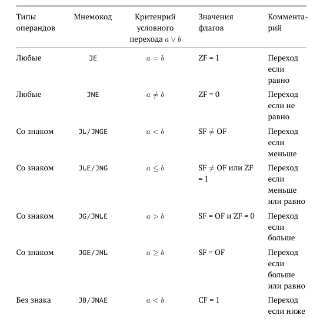
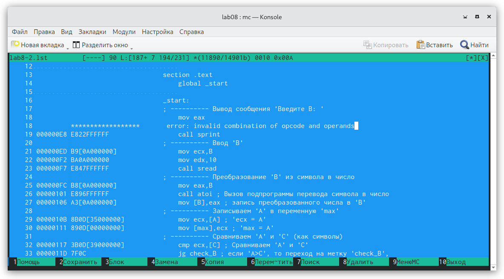

---
## Front matter
title: "Отчет по лабораторной работе 8"
subtitle: "Команды
безусловного и условного переходов в
Nasm. Программирование ветвлений."
author: "Гисматуллин Артём Вадимович НПИбд-01-22"

## Generic otions
lang: ru-RU
toc-title: "Содержание"

## Bibliography
bibliography: bib/cite.bib
csl: pandoc/csl/gost-r-7-0-5-2008-numeric.csl

## Pdf output format
toc: true # Table of contents
toc-depth: 2
lof: true # List of figures
lot: true # List of tables
fontsize: 12pt
linestretch: 1.5
papersize: a4
documentclass: scrreprt
## I18n polyglossia
polyglossia-lang:
  name: russian
  options:
	- spelling=modern
	- babelshorthands=true
polyglossia-otherlangs:
  name: english
## I18n babel
babel-lang: russian
babel-otherlangs: english
## Fonts
mainfont: PT Serif
romanfont: PT Serif
sansfont: PT Sans
monofont: PT Mono
mainfontoptions: Ligatures=TeX
romanfontoptions: Ligatures=TeX
sansfontoptions: Ligatures=TeX,Scale=MatchLowercase
monofontoptions: Scale=MatchLowercase,Scale=0.9
## Biblatex
biblatex: true
biblio-style: "gost-numeric"
biblatexoptions:
  - parentracker=true
  - backend=biber
  - hyperref=auto
  - language=auto
  - autolang=other*
  - citestyle=gost-numeric
## Pandoc-crossref LaTeX customization
figureTitle: "Рис."
tableTitle: "Таблица"
listingTitle: "Листинг"
lofTitle: "Список иллюстраций"
lotTitle: "Список таблиц"
lolTitle: "Листинги"
## Misc options
indent: true
header-includes:
  - \usepackage{indentfirst}
  - \usepackage{float} # keep figures where there are in the text
  - \floatplacement{figure}{H} # keep figures where there are in the text
---

# Цель работы

Изучение команд условного и безусловного переходов. Приобретение навы-
ков написания программ с использованием переходов. Знакомство с назначе-
нием и структурой файла листинга.

# Задание

1. Реализовать безусловный переход с помощью листинга 8.1. Выполнить соответствующее задание с выводом сообщений
в определенном порядке.

2. Реализовать программу листинга 8.3, выводящую на экран наибольшее из трех целочисленных значений.

3. Изучить структуру файлов листинга. Ответить на вопросы.

4. Реализовать прорамму по нахождению наименьшего из трех целочисленных значений.

5. Написать программу, которая будет вычислять значение функции с определенным условием и данными значениями переменных (по вариантам).

# Теоретическое введение

Для реализации ветвлений в ассемблере используются так называемые ко-
манды передачи управления или команды перехода. Можно выделить 2 типа
переходов:

• условный переход – выполнение или не выполнение перехода в определен-
ную точку программы в зависимости от проверки условия.

• безусловный переход – выполнение передачи управления в определенную
точку программы без каких-либо условий.

## Команды безусловного перехода

Безусловный переход выполняется инструкцией jmp,
которая включает в себя адрес перехода, куда следует передать управление:

jmp <адрес_перехода>

Адрес перехода может быть либо меткой, либо адресом области памяти, в
которую предварительно помещен указатель перехода. Кроме того, в качестве
операнда можно использовать имя регистра, в таком случае переход будет осу-
ществляться по адресу, хранящемуся в этом регистре.

## Команды условного перехода

В ассемблере команды условного перехода вычисляют условие
перехода анализируя флаги из регистра флагов.

### Флаги

Флаг – это бит, принимающий значение 1 («флаг установлен»), если выпол-
нено некоторое условие, и значение 0 («флаг сброшен») в противном случае.
Флаги работают независимо друг от друга, и лишь для удобства они помещены в
единый регистр — регистр флагов, отражающий текущее состояние процессора.

В следующей таблице указано положение битовых флагов в регистре флагов (рис. [-@fig:001])

{ #fig:001 width=70%, height=70% }

Флаги состояния (биты 0, 2, 4, 6, 7 и 11) отражают результат выполнения
арифметических инструкций, таких как ADD, SUB, MUL, DIV.

### Описание инструкции cmp

Инструкция cmp является одной из инструкций, которая позволяет сравнить
операнды и выставляет флаги в зависимости от результата сравнения.
Инструкция cmp является командой сравнения двух операндов и имеет такой
же формат, как и команда вычитания:

cmp <операнд_1>, <операнд_2>

Команда cmp, так же как и команда вычитания, выполняет вычитание
<операнд_2> - <операнд_1>, но результат вычитания никуда не записывается
и единственным результатом команды сравнения является формирование
флагов.

### Описание команд условного перехода.

Команда условного перехода имеет вид

j<мнемоника перехода> label

Мнемоника перехода связана со значением анализируемых флагов или со
способом формирования этих флагов.
В таблице (рис. [-@fig:002]) представлены некоторые команды условного перехода, которые обычно ста-
вятся после команды сравнения cmp. В их мнемокодах указывается тот резуль-
тат сравнения, при котором надо делать переход. Мнемоники, идентичные по
своему действию, написаны в таблице через дробь (например, ja и jnbe). Про-
граммист выбирает, какую из них применить, чтобы получить более простой
для понимания текст программы.

{ #fig:002 width=70%, height=70% }

## Файл листинга и его структура

Листинг (в рамках понятийного аппарата NASM) — это один из выходных фай-
лов, создаваемых транслятором. Он имеет текстовый вид и нужен при отладке
программы, так как кроме строк самой программы он содержит дополнитель-
ную информацию.

Все ошибки и предупреждения, обнаруженные при ассемблировании, транс-
лятор выводит на экран, и файл листинга не создаётся.
Итак, структура листинга:

• номер строки — это номер строки файла листинга (нужно помнить, что
номер строки в файле листинга может не соответствовать номеру строки
в файле с исходным текстом программы);

• адрес — это смещение машинного кода от начала текущего сегмента;

• машинный код представляет собой ассемблированную исходную строку
в виде шестнадцатеричной последовательности. (например, инструкция
int 80h начинается по смещению 00000020 в сегменте кода; далее идёт
машинный код, в который ассемблируется инструкция, то есть инструкция
int 80h ассемблируется в CD80 (в шестнадцатеричном представлении);
CD80 — это инструкция на машинном языке, вызывающая прерывание
ядра);

• исходный текст программы — это просто строка исходной программы вме-
сте с комментариями (некоторые строки на языке ассемблера, например,
строки, содержащие только комментарии, не генерируют никакого ма-
шинного кода, и поля «смещение» и «исходный текст программы» в таких
строках отсутствуют, однако номер строки им присваивается).

# Выполнение лабораторной работы

1. Создаем каталог для программам лабораторной работы No 8, перейдим в
него и создаем файл lab8-1.asm. (рис. [-@fig:003])

{ #fig:003 width=70%, height=70% }

2. Ввели в файл lab8-1.asm текст программы листинга, создали исполняемый файл и посмотрели результат программы. (рис. [-@fig:004])

{ #fig:004 width=70%, height=70% }

3. Внесли в файл lab8-1.asm изменение такие, чтобы программа делала другую очередность вывода сообщения,
создали исполняемый файл и посмотрели результат программы. (рис. [-@fig:005])

{ #fig:005 width=70%, height=70% }

4. Внесли в файл lab8-1.asm другие изменения - теперь программа выводит сообщения в обратном порядке,
создали исполняемый файл и посмотрели результат программы. (рис. [-@fig:006])

{ #fig:006 width=70%, height=70% }

5. Создали файл lab8-2.asm в каталоге ~/work/arch-pc/lab08. Внимательно
изучили текст программы из листинга 8.3 и ввели в lab8-2.asm. Проверили
работоспособность, введя различные значения В. (рис. [-@fig:007])

{ #fig:007 width=70%, height=70% }

6. Получили файл листинга программы lab8-2.asm. Изучили его содержимое. (рис. [-@fig:008])

{ #fig:008 width=70%, height=70% }

Если обратить внимание на строки 18-20, то можно сделать вывод о следующем:

- Исходный текст программы - это просто строка исходной программы с коммантариями. Комментарии не генерируют
никакого машинного кода, но отдельной строке-комментарию присваивается ее номер (строка 20).

- Строки 18 и 19 содержат так же адрес (смещение машинного кода от начала текущего сегмента,
например, 000000Е8) и машинный код (В8), который представляет собой ассемблированную исходную строку
в виде шестнадцатеричной последовательности. В8, к примеру, - это инструкция на машинном языке:
в регистр eax помещается содержимое msg.

7. Далее мы удаляем один операнд инструкции mov и проверяем файл листинга. (рис. [-@fig:009])

{ #fig:009 width=70%, height=70% }

Можем заметить, что на месте ошибки слева отображены звездочки вместо адреса и машинного кода,
что уже свидетельствует об ошибке. Кроме того, справа отображено описание самой ошибки.

# Выолнение задание для самостоятельной работы

Суть задания для самостоятельной работы заключается в том, чтобы написать программу для решения некоторой функции,
а также программу, которая будет выводить по трем полученным целочисленным значениям переменных наименьшее из них.
Так как на прошлой лабораторной работе я нашел, что мой вариант - 11, то значения я буду брать соответствующие.

1. Выполнение заданий начну с того, что напишу программу (lab8-3.asm), которая будет выводить наименьшее значение из трех.
Основываясь на полученных знаниях, я написал ее следующим образом: (рис. [-@fig:010])

{ #fig:010 width=70%, height=70% }

Проверка работоспособности файла: (рис. [-@fig:011])

{ #fig:011 width=70%, height=70% }

2. Далее следует написать код (lab8-4.asm), который по введенным значениям проверяет их на условия и выводит получившийся
результат. Условия прописаны в самой функции под вариантом 11. Код выглядит так: (рис. [-@fig:012])

{ #fig:012 width=70%, height=70% }

Проверка работоспособности: (рис. [-@fig:013])

{ #fig:013 width=70%, height=70% }

# Выводы

В ходе работы я изучил команды условного и безусловного переходов, приобрел навы-
ки написания программ с использованием переходов, а также познакомился с назначе-
нием и структурой файла листинга.

# Список литературы{.unnumbered}

::: {#refs}
:::
