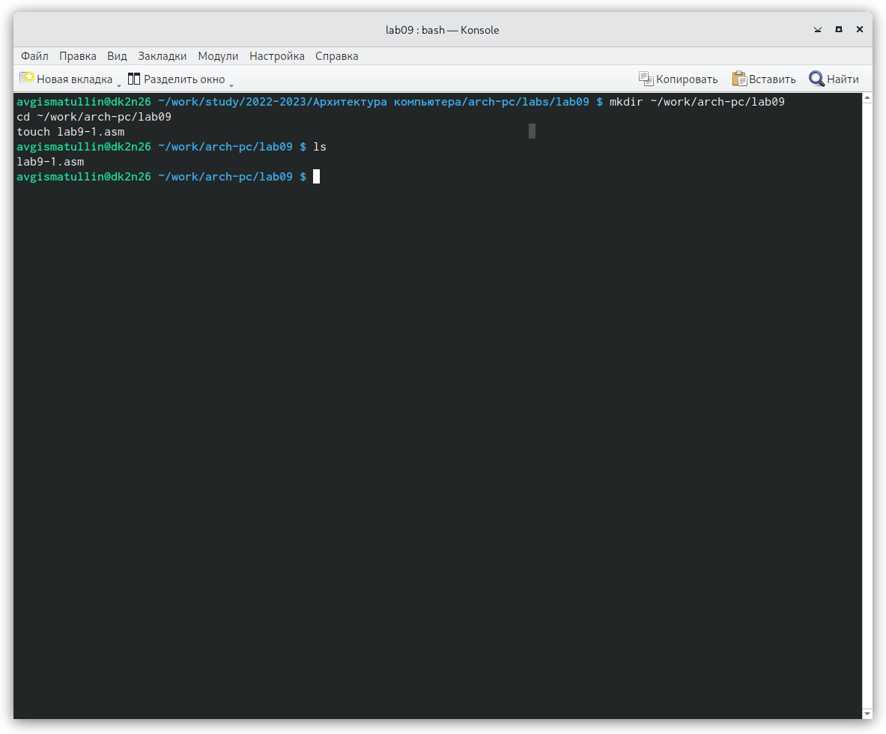
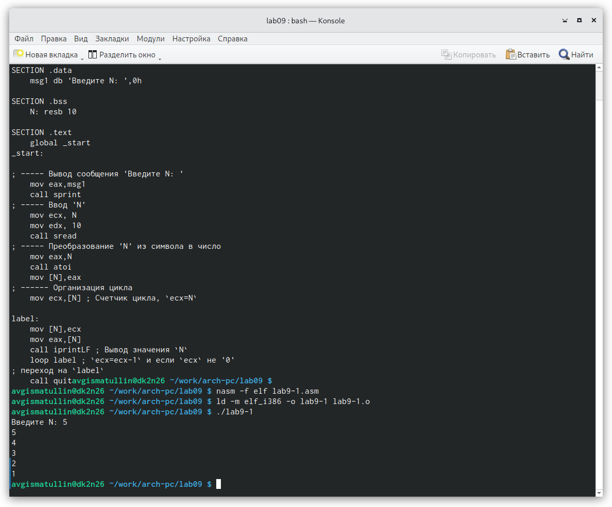
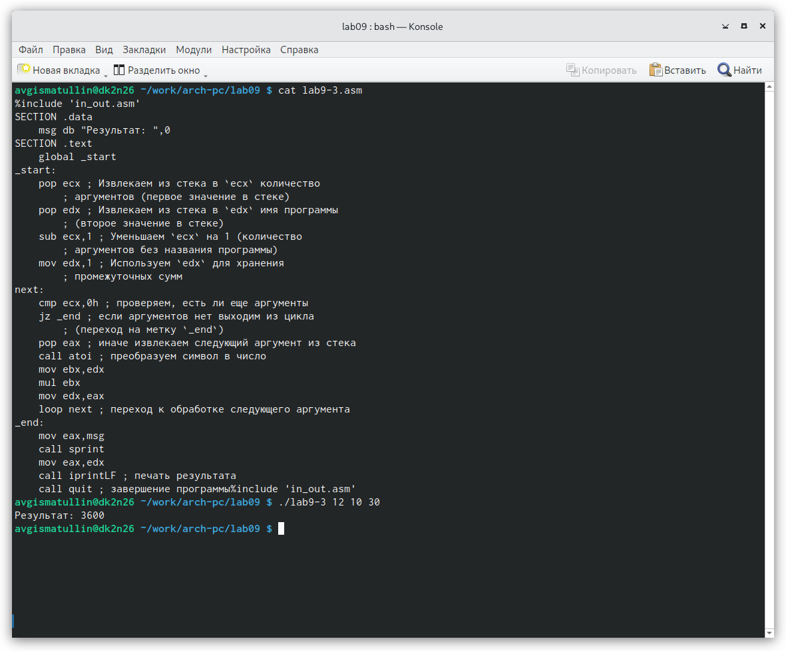

---
## Front matter
title: "Отчет по лабораторной работе 9"
subtitle: "Программирование цикла. Обработка
аргументов командной строки."
author: "Гисматуллин Артём Вадимович НПИбд-01-22"

## Generic otions
lang: ru-RU
toc-title: "Содержание"

## Bibliography
bibliography: bib/cite.bib
csl: pandoc/csl/gost-r-7-0-5-2008-numeric.csl

## Pdf output format
toc: true # Table of contents
toc-depth: 2
lof: true # List of figures
lot: true # List of tables
fontsize: 12pt
linestretch: 1.5
papersize: a4
documentclass: scrreprt
## I18n polyglossia
polyglossia-lang:
  name: russian
  options:
	- spelling=modern
	- babelshorthands=true
polyglossia-otherlangs:
  name: english
## I18n babel
babel-lang: russian
babel-otherlangs: english
## Fonts
mainfont: PT Serif
romanfont: PT Serif
sansfont: PT Sans
monofont: PT Mono
mainfontoptions: Ligatures=TeX
romanfontoptions: Ligatures=TeX
sansfontoptions: Ligatures=TeX,Scale=MatchLowercase
monofontoptions: Scale=MatchLowercase,Scale=0.9
## Biblatex
biblatex: true
biblio-style: "gost-numeric"
biblatexoptions:
  - parentracker=true
  - backend=biber
  - hyperref=auto
  - language=auto
  - autolang=other*
  - citestyle=gost-numeric
## Pandoc-crossref LaTeX customization
figureTitle: "Рис."
tableTitle: "Таблица"
listingTitle: "Листинг"
lofTitle: "Список иллюстраций"
lotTitle: "Список таблиц"
lolTitle: "Листинги"
## Misc options
indent: true
header-includes:
  - \usepackage{indentfirst}
  - \usepackage{float} # keep figures where there are in the text
  - \floatplacement{figure}{H} # keep figures where there are in the text
---

# Цель работы

Приобретение навыков написания программ с использованием циклов и
обработкой аргументов командной строки.

# Задание

1. Реализовать цикл с помощью листинга 9.1. Выполнить соответствующее задание с использованием
регистра ecx в теле цикла

2. Изменить цикл так, чтоб использовать внутри него регистр ecx вкупе со стеком.

3. Обработать аргументы командной строки на основе листинга 9.2.

4. Реализовать программу по вычислению суммы поступающих аргументов. Переписать
программу так, чтобы она вычисляла на их основе произведение.

5. Написать программу, которая находит сумму значений функции (на основе варианта 11).

# Теоретическое введение

## Организация стека

Стек — это структура данных, организованная по принципу LIFO. Стек является частью
архитектуры процессора и реализован на аппаратном уровне. Для работы со
стеком в процессоре есть специальные регистры (ss, bp, sp) и команды.

Основной функцией стека является функция сохранения адресов возврата
и передачи аргументов при вызове процедур. Кроме того, в нём выделяется
память для локальных переменных и могут временно храниться значения реги-
стров. 

Стек имеет вершину, адрес последнего добавленного элемента, который хра-
нится в регистре esp (указатель стека). Противоположный конец стека называ-
ется дном. Значение, помещённое в стек последним, извлекается первым. При
помещении значения в стек указатель стека уменьшается, а при извлечении —
увеличивается.

Для стека существует две основные операции:

• добавление элемента в вершину стека (push);

• извлечение элемента из вершины стека (pop).

### Добавление элемента в стек.

Команда push размещает значение в стеке, т.е. помещает значение в ячейку
памяти, на которую указывает регистр esp, после этого значение регистра esp
увеличивается на 4. Данная команда имеет один операнд — значение, которое
необходимо поместить в стек.

Существует ещё две команды для добавления значений в стек. Это команда
pusha, которая помещает в стек содержимое всех регистров общего назначения в
следующем порядке: ах, сх, dx, bх, sp, bp, si, di. А также команда pushf, которая
служит для перемещения в стек содержимого регистра флагов. Обе эти команды
не имеют операндов.

### Извлечение элемента из стека.

Команда pop извлекает значение из стека, т.е. извлекает значение из ячейки
памяти, на которую указывает регистр esp, после этого уменьшает значение
регистра esp на 4. У этой команды также один операнд, который может быть
регистром или переменной в памяти.

Нужно помнить, что извлечённый из стека элемент не стирается из памяти и
остаётся как “мусор”, который будет перезаписан при записи нового значения в
стек.

Аналогично команде записи в стек существует команда popa, которая вос-
станавливает из стека все регистры общего назначения, и команда popf для
перемещения значений из вершины стека в регистр флагов.

## Инструкции организации циклов

Для организации циклов существуют специальные инструкции. Для всех ин-
струкций максимальное количество проходов задаётся в регистре ecx. Наиболее
простой является инструкция loop. Она позволяет организовать безусловный
цикл.

Иструкция loop выполняется в два этапа. Сначала из регистра ecx вычитается
единица и его значение сравнивается с нулём. Если регистр не равен нулю,
то выполняется переход к указанной метке. Иначе переход не выполняется и
управление передаётся команде, которая следует сразу после команды loop.

# Выполнение лабораторной работы

1. Создаем каталог для программам лабораторной работы No 9, перейдим в
него и создаем файл lab9-1.asm. (рис. [-@fig:001])

{ #fig:001 width=70%, height=70% }

2. Ввели в файл lab9-1.asm текст программы листинга, создали исполняемый файл и посмотрели результат программы. (рис. [-@fig:002])

{ #fig:002 width=70%, height=70% }

Программа циклично выводит N значений по убыванию. Работает корректно

Далее производим некоторые в ней изменения, начиная взаимодействовать с регистром ecx в самом цикле. Результат: (рис. [-@fig:003])

{ #fig:003 width=70%, height=70% }

При следующем коде: (рис. [-@fig:004])

{ #fig:004 width=70%, height=70% }

Инструкция loop сама следит за изменениями значений в регистре ecx. Реализованное выше вмешательство приводит к тому,
что цикл продолжался бесконечно.

Конечно, для использования регистра ecx в цикле и сохранения корректности работы
программы можно использовать стек. Реализация этого следующая: (рис. [-@fig:005])

{ #fig:005 width=70%, height=70% }

3. Далее мы сталкиваемся в обработкой аргументов. Для этого изучим текст программы листинга 9.2
 и запустим его (в lab9-2.asm): (рис. [-@fig:006])

{ #fig:006 width=70%, height=70% }

При данном вводе программой было обработано 4 аргумента, обозначенные переходом на следующую строку.

4. Затем создаем файл lab9-3.asm, изучаем программу листинга 9.3 по суммированию всех аргументов и запускаем ее: (рис. [-@fig:007])

{ #fig:007 width=70%, height=70% }

После этого требуется написать похожую программу, но для нахождения произведения всех элементов.
 Я реализовал ее следующим образом (изменения внес в самом файле lab9-3.asm - новый не создавал): (рис. [-@fig:008])

{ #fig:008 width=70%, height=70% }

Здесь же мы можем увидеть демонстрацию работоспособности программы.

# Выполнение задания для самостоятельной работы

Суть задания для самостоятельной работы заключается в том, чтобы написать программу для решения некоторой функции,
но на вход получить сразу несколько аргументов этой функции. Финальным ответом же будет сумма всех полученных значений.
Так как на прошлой лабораторной работе я нашел, что мой вариант - 11, то значения я буду брать соответствующие.

Решил же я это задание следующим образом (файл lab9-4.asm): (рис. [-@fig:009])

{ #fig:009 width=70%, height=70% }

Демонтрация работоспособности: (рис. [-@fig:010])

{ #fig:010 width=70%, height=70% }

# Выводы

В ходе работы я приобрел навыки написания программ с использованием циклов и
обработкой аргументов командной строки.

# Список литературы{.unnumbered}

::: {#refs}
:::
