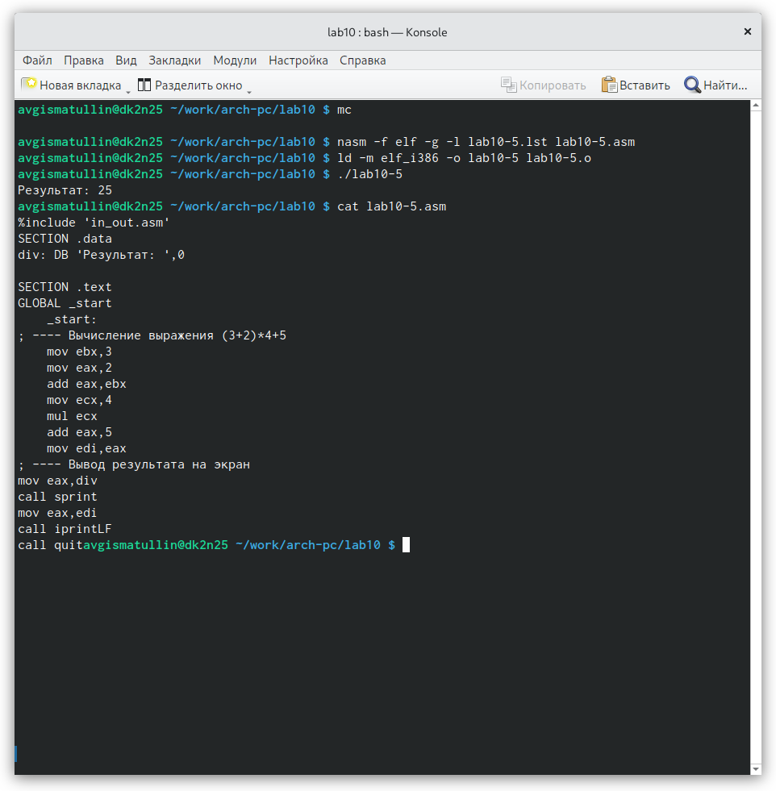

---
## Front matter
title: "Отчет по лабораторной работе 10"
subtitle: "Понятие
подпрограммы. Отладчик GDB."
author: "Гисматуллин Артём Вадимович НПИбд-01-22"

## Generic otions
lang: ru-RU
toc-title: "Содержание"

## Bibliography
bibliography: bib/cite.bib
csl: pandoc/csl/gost-r-7-0-5-2008-numeric.csl

## Pdf output format
toc: true # Table of contents
toc-depth: 2
lof: true # List of figures
lot: true # List of tables
fontsize: 12pt
linestretch: 1.5
papersize: a4
documentclass: scrreprt
## I18n polyglossia
polyglossia-lang:
  name: russian
  options:
	- spelling=modern
	- babelshorthands=true
polyglossia-otherlangs:
  name: english
## I18n babel
babel-lang: russian
babel-otherlangs: english
## Fonts
mainfont: PT Serif
romanfont: PT Serif
sansfont: PT Sans
monofont: PT Mono
mainfontoptions: Ligatures=TeX
romanfontoptions: Ligatures=TeX
sansfontoptions: Ligatures=TeX,Scale=MatchLowercase
monofontoptions: Scale=MatchLowercase,Scale=0.9
## Biblatex
biblatex: true
biblio-style: "gost-numeric"
biblatexoptions:
  - parentracker=true
  - backend=biber
  - hyperref=auto
  - language=auto
  - autolang=other*
  - citestyle=gost-numeric
## Pandoc-crossref LaTeX customization
figureTitle: "Рис."
tableTitle: "Таблица"
listingTitle: "Листинг"
lofTitle: "Список иллюстраций"
lotTitle: "Список таблиц"
lolTitle: "Листинги"
## Misc options
indent: true
header-includes:
  - \usepackage{indentfirst}
  - \usepackage{float} # keep figures where there are in the text
  - \floatplacement{figure}{H} # keep figures where there are in the text
---

# Цель работы

Приобретение навыков написания программ с использованием подпрограмм.
Знакомство с методами отладки при помощи GDB и его основными возможно-
стями.

# Задание

1. Рассмотрите программу вычисления выражения f(x) = 2х + 7 с помощью подпрограммы. Добавьте в нее подпрограмму вычисления выражения f(g(x)).

2. Проведите отладку программы листинга 10.2. Выполните соответствующие задания по изучению процесса отладки (точки останова, работа с данными программами в gdb, обработка аргументов).

3. Преобразовать программу из лабораторной работы №9, реализовав вычисления как подпрограмму.

4. С помощью отладчика gdb определить ошибку программы листинга 10.3.

# Теоретическое введение

## Понятие об отладке

Отладка — это процесс поиска и исправления ошибок в программе. В общем
случае его можно разделить на четыре этапа:

• обнаружение ошибки;

• поиск её местонахождения;

• определение причины ошибки;

• исправление ошибки.

Можно выделить следующие типы ошибок:

• синтаксические ошибки — обнаруживаются во время трансляции исходно-
го кода и вызваны нарушением ожидаемой формы или структуры языка;

• семантические ошибки — являются логическими и приводят к тому, что
программа запускается, отрабатывает, но не даёт желаемого результата;

• ошибки в процессе выполнения — не обнаруживаются при трансляции и
вызывают прерывание выполнения программы (например, это ошибки,
связанные с переполнением или делением на ноль).

Второй этап — поиск местонахождения ошибки. Некоторые ошибки обнару-
жить довольно трудно. Лучший способ найти место в программе, где находится
ошибка, это разбить программу на части и произвести их отладку отдельно друг
от друга.

Третий этап — выяснение причины ошибки. После определения местона-
хождения ошибки обычно проще определить причину неправильной работы
программы.

Последний этап — исправление ошибки. После этого при повторном запус-
ке программы, может обнаружиться следующая ошибка, и процесс отладки
начнётся заново.

## Методы отладки

Наиболее часто применяют следующие методы отладки:

• создание точек контроля значений на входе и выходе участка программы;

• использование специальных программ-отладчиков.

Отладчики позволяют управлять ходом выполнения программы, контролиро-
вать и изменять данные. Это помогает быстрее найти место ошибки в программе
и ускорить её исправление. Наиболее популярные способы работы с отладчиком
— это использование точек останова и выполнение программы по шагам.

Пошаговое выполнение — это выполнение программы с остановкой после каж-
дой строчки, чтобы программист мог проверить значения переменных и вы-
полнить другие действия.

Точки останова — это специально отмеченные места в программе, в которых
программа-отладчик приостанавливает выполнение программы и ждёт команд.
Наиболее популярные виды точек останова:

• Breakpoint — точка останова (остановка происходит, когда выполнение
доходит до определённой строки, адреса или процедуры, отмеченной про-
граммистом);

• Watchpoint — точка просмотра (выполнение программы приостанавли-
вается, если программа обратилась к определённой переменной: либо
считала её значение, либо изменила его).

Точки останова устанавливаются в отладчике на время сеанса работы с кодом
программы, т.е. они сохраняются до выхода из программы-отладчика или до
смены отлаживаемой программы.

## Основные возможности отладчика GDB

GDB (GNU Debugger — отладчик проекта GNU) работает на многих UNIX-
подобных системах и умеет производить отладку многих языков программиро-
вания. GDB предлагает обширные средства для слежения и контроля за выпол-
нением компьютерных программ. Отладчик не содержит собственного графи-
ческого пользовательского интерфейса и использует стандартный текстовый
интерфейс консоли. Однако для GDB существует несколько сторонних графиче-
ских надстроек, а кроме того, некоторые интегрированные среды разработки
используют его в качестве базовой подсистемы отладки.

Отладчик GDB (как и любой другой отладчик) позволяет увидеть, что проис-
ходит «внутри» программы в момент её выполнения или что делает программа
в момент сбоя.
GDB может выполнять следующие действия:

• начать выполнение программы, задав всё, что может повлиять на её пове-
дение;

• остановить программу при указанных условиях;

• исследовать, что случилось, когда программа остановилась;

• изменить программу так, чтобы можно было поэкспериментировать с
устранением эффектов одной ошибки и продолжить выявление других.

### Понятие подпрограммы

Подпрограмма — это, как правило, функционально законченный участок кода,
который можно многократно вызывать из разных мест программы. В отличие от
простых переходов из подпрограмм существует возврат на команду, следующую
за вызовом.

Если в программе встречается одинаковый участок кода, его можно оформить
в виде подпрограммы, а во всех нужных местах поставить её вызов. При этом
подпрограмма будет содержаться в коде в одном экземпляре, что позволит
уменьшить размер кода всей программы.

Для вызова подпрограммы из основной программы используется инструкция
call, которая заносит адрес следующей инструкции в стек и загружает в регистр
eip адрес соответствующей подпрограммы, осуществляя таким образом пере-
ход. Затем начинается выполнение подпрограммы, которая, в свою очередь,
также может содержать подпрограммы.

Подпрограмма завершается инструкцией ret, которая извлекает из стека
адрес, занесённый туда соответствующей инструкцией call, и заносит его в
eip. После этого выполнение основной программы возобновится с инструкции,
следующей за инструкцией call.

Подпрограмма может вызываться как из внешнего файла, так и быть частью
основной программы.

# Выполнение лабораторной работы

1. Создаем каталог для программам лабораторной работы No 10, перейдим в
него и создаем файл lab10-1.asm. (рис. [-@fig:001])

{ #fig:001 width=70%, height=70% }

2. Ввели в файл lab10-1.asm текст программы листинга, создали исполняемый файл и посмотрели результат программы. (рис. [-@fig:002])

{ #fig:002 width=70%, height=70% }

Далее добавляем подпрограмму для вычисления функции g(x) = 3x - 1, и выполняем программу. Результат: (рис. [-@fig:003])

{ #fig:003 width=70%, height=70% }

3. Создаем файл lab10-2.asm с текстом программы из Листинга 10.2, получаем исполняемый файл с ключом '-g'. (рис. [-@fig:004])

{ #fig:004 width=70%, height=70% }

Проверяем работу программы, запустив ее в оболочке GDB с помощью коман-
ды run, устанавливаем брейкпоинт на метку _start, посмотрели
дисассимилированный код программы с помощью команды disassemble (рис. [-@fig:005])

{ #fig:005 width=70%, height=70% }

Затем переключаем на отображение команд с Intel’овским синтаксисом, введя
команду set disassembly-flavor intel (рис. [-@fig:006])

{ #fig:006 width=70%, height=70% }

Различия отображения синтаксиса машинных команд в режимах ATT и Intel отличаются
тем, что название регистра и адрес в режиме Intel меняются местами
и изменяются так, что читаемость листинга отладки становится лучше.

Затем включаем режим псевдографики для более удобного анализа программы: (рис. [-@fig:007])

{ #fig:007 width=70%, height=70% }

4. Далее устанавливаем еще одну точку останова по адресу инструкции, смотрим информацию
о всех установленных точках останова, а после начинаем работу с данными программы, выполняя
инструкции командой stepi (si): (рис. [-@fig:008])

{ #fig:008 width=70%, height=70% }

Можно проследить, как изменяются значения регистров eax, ebx, ecx, edx, eip и др.

5. После просмотра содержимого регистров, смотрим значение переменной msg1. (рис. [-@fig:009])

{ #fig:009 width=70%, height=70% }

6. Смотрим значение переменной msg1 по адресу, изменяем значение для этой переменной,
смотрим значение переменной msg2 и проводим с ним изменения первого символа: (рис. [-@fig:008])

{ #fig:010 width=70%, height=70% }

7. Далее выводим в различных форматах значение регистров eax и edx. (рис. [-@fig:011])

{ #fig:011 width=70%, height=70% }

Более того, значения регистров можно изменять с помощью команды set: (рис. [-@fig:012])

{ #fig:012 width=70%, height=70% }

Разница между выводом p/s для '2' и 2 заключается в том, что для данных
символов возвращается число из таблицы символов Unicode представляющее их позицию,
а строковые объекты и числа имеют разные значения.

8. Завершив выполнение программы, копируем файл lab9-2.asm в lab10-3.asm и запускаем
отладчик в программе с аргументами. Устанавливаем брэйкпоинт и смотрим количество
аргументов командной строки: (рис. [-@fig:013])

{ #fig:013 width=70%, height=70% }

9. C помощью команды x/s *(void**)($esp + n) можно посмотреть, какие аргументы находятся в стеке: (рис. [-@fig:014])

{ #fig:014 width=70%, height=70% }

Примечательно следующее: адрес выглядит, как [$esp + n], где n кратно 4. Это вызвано тем,
что n - число байт, на которое смещен элемент относительно вершины стека.

# Выполнение задания для самостоятельной работы

Суть задания для самостоятельной работы заключается в том, чтобы преобразовать программу из
лабораторной работы №9, реализовав вычисление значения функции как подпрограмму, а также изучить
листинг 10.3 с помощью отладчика gdb и определить в нем ошибку.

1. Создадим файл lab10-4.asm для создания подпрограммы для функции. Скопируем программу из файла
lab9-4.asm, цель которой была вычисление сумм значений функций f(x) = 15x + 2. Перепишем ее, добавив подпрограмму. Результат получился следующим: (рис. [-@fig:015])

{ #fig:015 width=70%, height=70% }

Ответ получился верным.

2. Скопируем программу листинга 10.3 в файл lab10-5.asm, запустим его в gdb и проследим за изменением
значений регистров. (рис. [-@fig:016])

{ #fig:016 width=70%, height=70% }

Здесь сразу можно обратить внимание, что значение из регистра eax прибавляется к ebx, а не наоборот.
Ввиду этого на данный момент значение в eax равно 8. Проходим далее: (рис. [-@fig:017])

{ #fig:017 width=70%, height=70% }

Здесь тоже можно сделать вывод, что значения прибавляются не к тому регистру, а edi запоминает
число из ebx, что тоже неверно. Основываясь на всех этих недочетах, я переписал программу следующим образом: (рис. [-@fig:018])

{ #fig:018 width=70%, height=70% }

# Выводы

В ходе работы я приобрел навыки написания программ с использованием подпрограмм, познакомился с методами отладки при помощи GDB
 и его основными возможностями.

# Список литературы{.unnumbered}

::: {#refs}
:::
