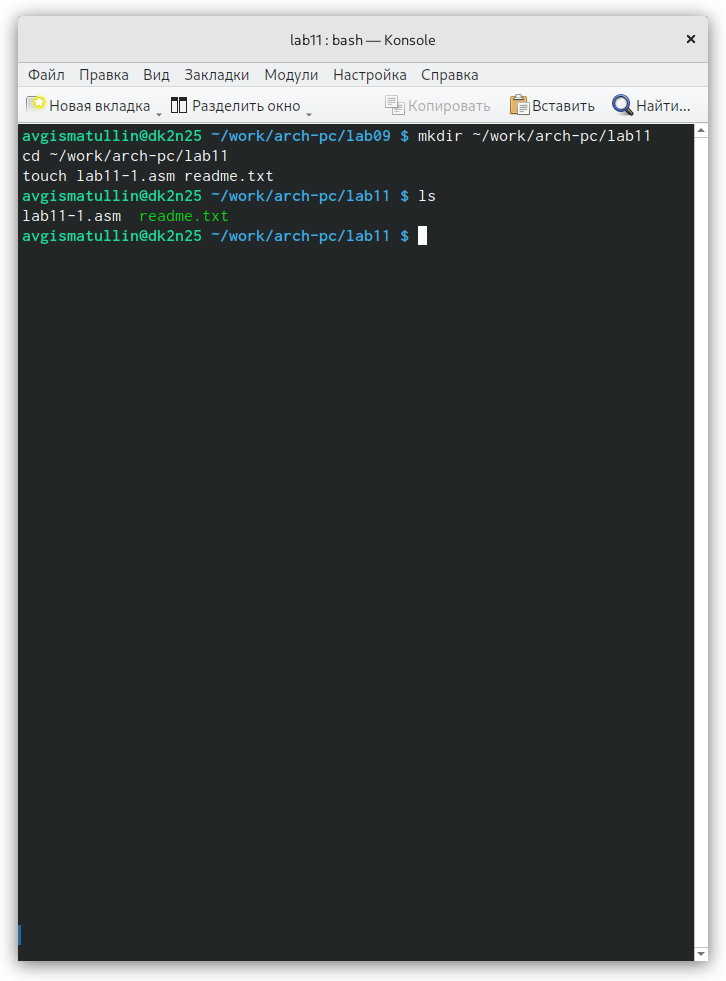
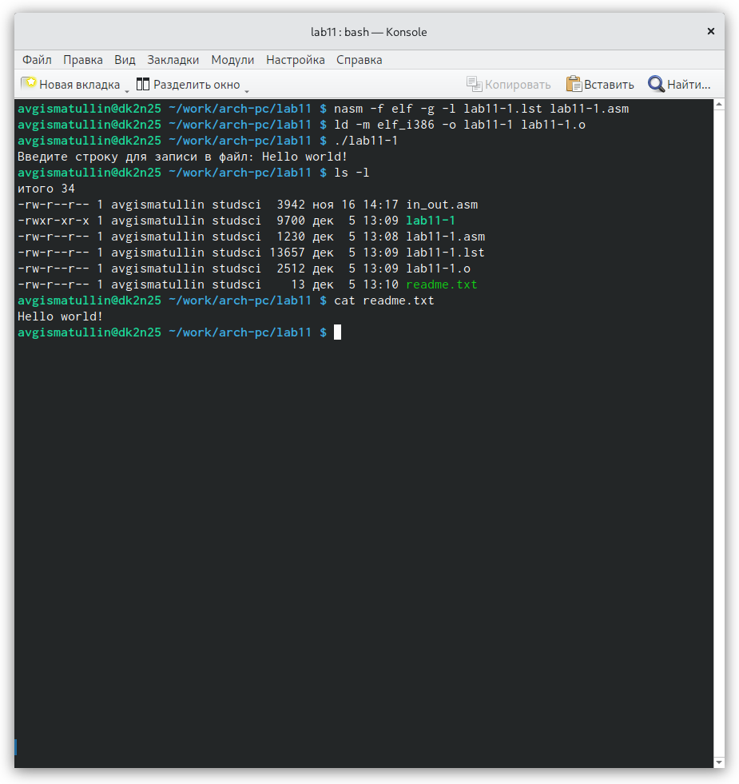
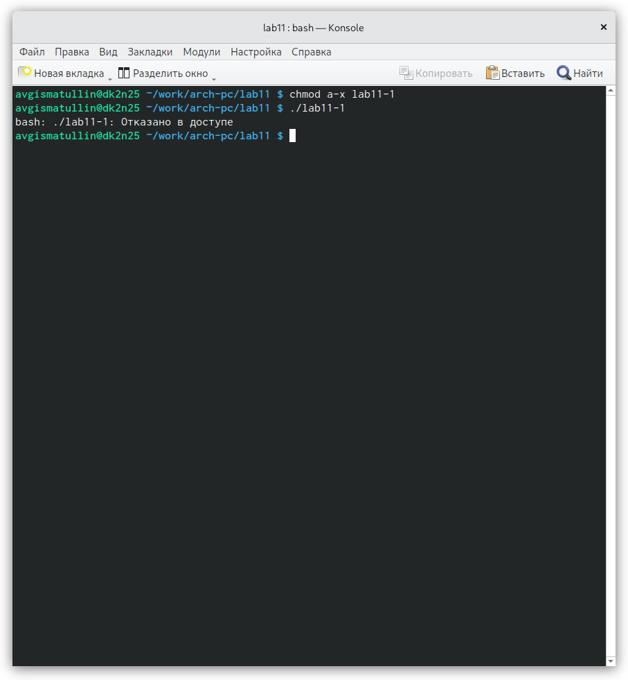
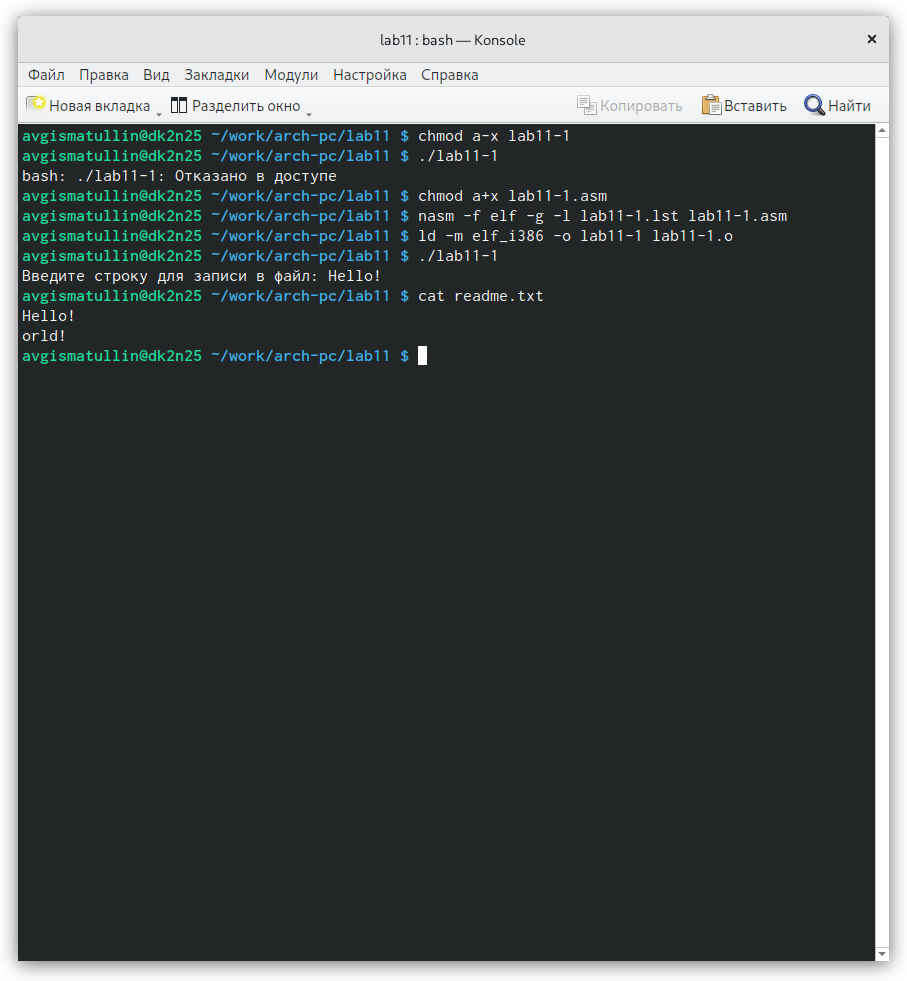
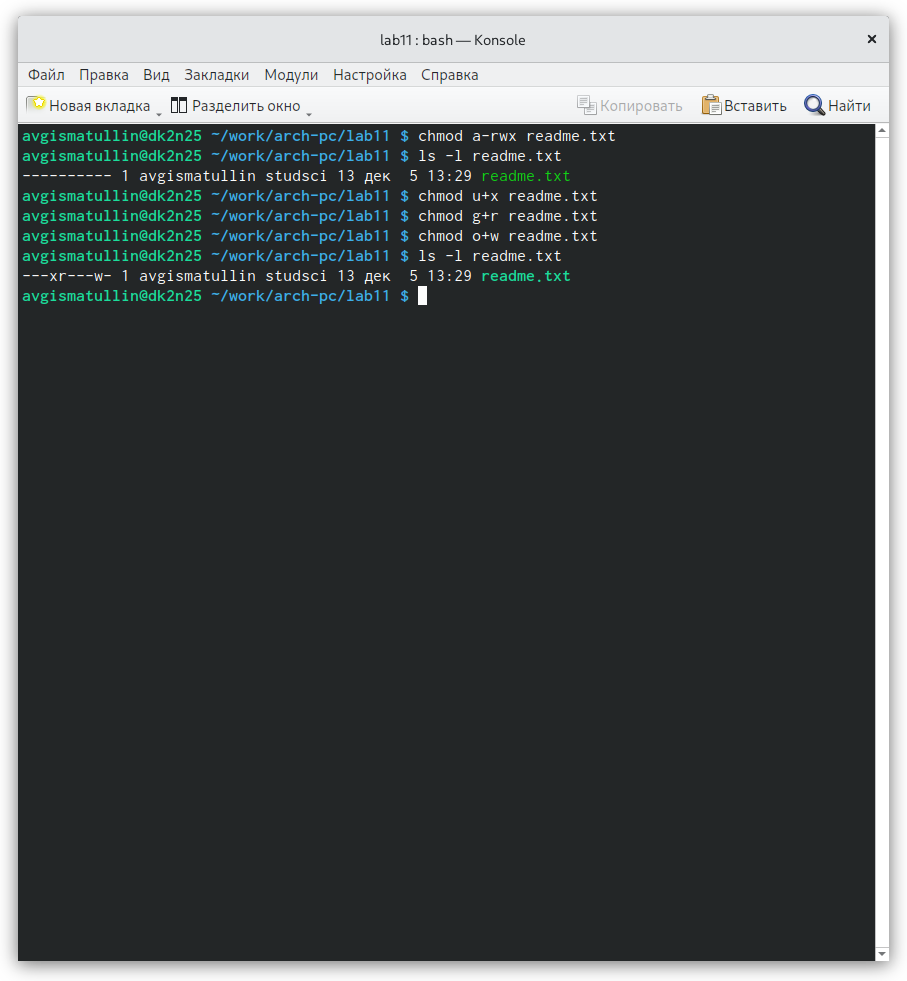
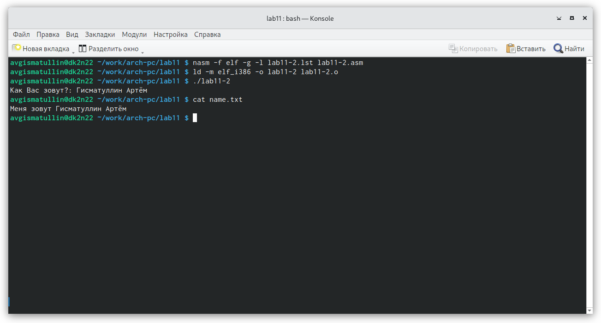
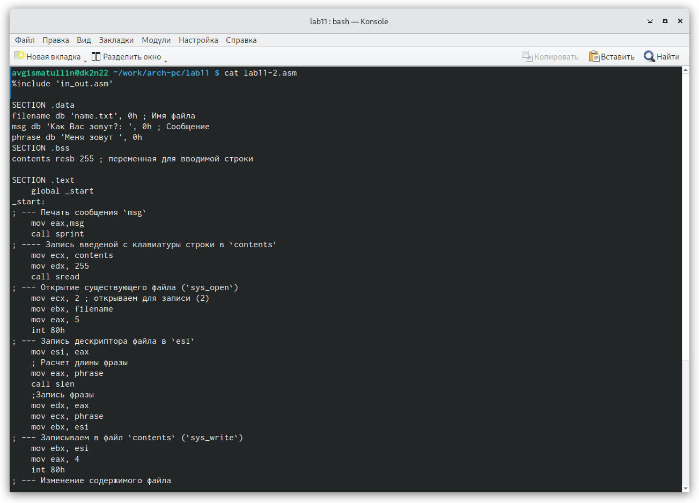
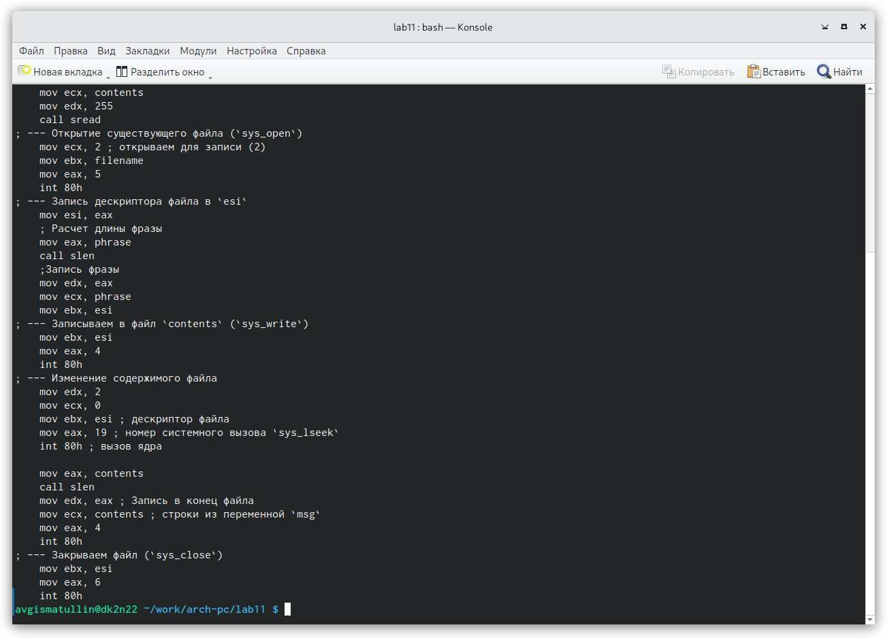

---
## Front matter
title: "Отчет по лабораторной работе 11"
subtitle: "Работа с
файлами средствами Nasm"
author: "Гисматуллин Артём Вадимович НПИбд-01-22"

## Generic otions
lang: ru-RU
toc-title: "Содержание"

## Bibliography
bibliography: bib/cite.bib
csl: pandoc/csl/gost-r-7-0-5-2008-numeric.csl

## Pdf output format
toc: true # Table of contents
toc-depth: 2
lof: true # List of figures
lot: true # List of tables
fontsize: 12pt
linestretch: 1.5
papersize: a4
documentclass: scrreprt
## I18n polyglossia
polyglossia-lang:
  name: russian
  options:
	- spelling=modern
	- babelshorthands=true
polyglossia-otherlangs:
  name: english
## I18n babel
babel-lang: russian
babel-otherlangs: english
## Fonts
mainfont: PT Serif
romanfont: PT Serif
sansfont: PT Sans
monofont: PT Mono
mainfontoptions: Ligatures=TeX
romanfontoptions: Ligatures=TeX
sansfontoptions: Ligatures=TeX,Scale=MatchLowercase
monofontoptions: Scale=MatchLowercase,Scale=0.9
## Biblatex
biblatex: true
biblio-style: "gost-numeric"
biblatexoptions:
  - parentracker=true
  - backend=biber
  - hyperref=auto
  - language=auto
  - autolang=other*
  - citestyle=gost-numeric
## Pandoc-crossref LaTeX customization
figureTitle: "Рис."
tableTitle: "Таблица"
listingTitle: "Листинг"
lofTitle: "Список иллюстраций"
lotTitle: "Список таблиц"
lolTitle: "Листинги"
## Misc options
indent: true
header-includes:
  - \usepackage{indentfirst}
  - \usepackage{float} # keep figures where there are in the text
  - \floatplacement{figure}{H} # keep figures where there are in the text
---

# Цель работы

Приобретение навыков написания программ для работы с файлами.

# Задание

1. Ввести в файл lab11-1.asm текст программы из листинга 11.1. Проверить его
работу.

2. С помощью команды chmod изменить права доступа к lab11-1, запретив его исполнение. Попытаться выполнить файл.

3. С помощью команды chmod изменить права доступа, добавив права к исполнению, к lab11-1.asm. Попытаться выполнить файл и объяснить результаты

4. Изменить права доступа к файлу readme.txt в соответствии с вариантом 11.

5. Написать программу, работающую по определенному алгоритму.

# Теоретическое введение

## Права доступа к файлам

ОС GNU/Linux является многопользовательской операционной системой. И
для обеспечения защиты данных одного пользователя от действий других поль-
зователей существуют специальные механизмы разграничения доступа к фай-
лам. Кроме ограничения доступа, данный механизм позволяет разрешить дру-
гим пользователям доступ данным для совместной работы.

Права доступа определяют набор действий (чтение, запись, выполнение), раз-
решённых для выполнения пользователям системы над файлами. Для каждого
файла пользователь может входить в одну из трех групп: владелец, член группы
владельца, все остальные. Для каждой из этих групп может быть установлен свой
набор прав доступа. Владельцем файла является его создатель. 

Набор прав доступа задается тройками битов и состоит из прав на чтение,
запись и исполнение файла. В символьном представлении он имеет вид строк
rwx, где вместо любого символа может стоять дефис. Всего возможно 8 комбина-
ций. Буква означает наличие права (установлен в
единицу второй бит триады r — чтение, первый бит w — запись, нулевой бит х —
исполнение), а дефис означает отсутствие права (нулевое значение соответству-
ющего бита). Также права доступа могут быть представлены как восьмеричное
число. Так, права доступа rw- (чтение и запись, без исполнения) понимаются
как три двоичные цифры 110 или как восьмеричная цифра 6.

Для изменения прав доступа служит команда chmod, которая понимает как
символьное, так и числовое указание прав.

## Работа с файлами средствами Nasm

В операционной системе Linux существуют различные методы управления
файлами, например, такие как создание и открытие файла, только для чтения
или для чтения и записи, добавления в существующий файл, закрытия и удале-
ния файла, предоставление прав доступа.

Обработка файлов в операционной системе Linux осуществляется за счет
использования определенных системных вызовов. Для корректной работы и
доступа к файлу при его открытии или создании, файлу присваивается уникаль-
ный номер (16-битное целое число) – дескриптор файла.

Общий алгоритм работы с системными вызовами в Nasm можно представить
в следующем виде:

1. Поместить номер системного вызова в регистр EAX;

2. Поместить аргументы системного вызова в регистрах EBX, ECX и EDX;

3. Вызов прерывания (int 80h);

4. Результат обычно возвращается в регистр EAX.

### Открытие и создание файла
Для создания и открытия файла служит системный вызов sys_creat, который
использует следующие аргументы: права доступа к файлу в регистре ECX, имя
файла в EBX и номер системного вызова sys_creat (8) в EAX.

Для открытия существующего файла служит системный вызов sys_open, ко-
торый использует следующие аргументы: права доступа к файлу в регистре
EDX, режим доступа к файлу в регистр ECX, имя файла в EBX и номер системного
вызова sys_open (5) в EAX.

### Запись в файл
Для записи в файл служит системный вызов sys_write, который использует
следующие аргументы: количество байтов для записи в регистре EDX, строку
содержимого для записи ECX, файловый дескриптор в EBX и номер системного
вызова sys_write (4) в EAX.

Системный вызов возвращает фактическое количество записанных байтов в
регистр EAX. В случае ошибки, код ошибки также будет находиться в регистре
EAX.

Прежде чем записывать в файл, его необходимо создать или открыть, что
позволит получить дескриптор файла.

### Чтение файла
Для чтения данных из файла служит системный вызов sys_read, который
использует следующие аргументы: количество байтов для чтения в регистре EDX,
адрес в памяти для записи прочитанных данных в ECX, файловый дескриптор в
EBX и номер системного вызова sys_read (3) в EAX. Как и для записи, прежде чем
читать из файла, его необходимо открыть, что позволит получить дескриптор
файла.

### Закрытие файла
Для правильного закрытия файла служит системный вызов sys_close, кото-
рый использует один аргумент – дескриптор файла в регистре EBX. После вызова
ядра происходит удаление дескриптора файла, а в случае ошибки, системный
вызов возвращает код ошибки в регистр EAX.

### Изменение содержимого файла
Для изменения содержимого файла служит системный вызов sys_lseek, ко-
торый использует следующие аргументы: исходная позиция для смещения EDX,
значение смещения в байтах в ECX, файловый дескриптор в EBX и номер систем-
ного вызова sys_lseek (19) в EAX.

Значение смещения можно задавать в байтах.

### Удаление файла
Удаление файла осуществляется системным вызовом sys_unlink, который
использует один аргумент – имя файла в регистре EBX.

# Выполнение лабораторной работы

1. Создаем каталог для программам лабораторной работы No 11, переходим в
него и создаем файл lab11-1.asm. (рис. [-@fig:001])

{ #fig:001 width=70%, height=70% }

2. Ввели в файл lab11-1.asm текст программы листинга, создали исполняемый файл и посмотрели результат программы. (рис. [-@fig:002])

{ #fig:002 width=70%, height=70% }

3. C помощью команды chmod изменили права доступа к исполняемому файлу lab11-1. (рис. [-@fig:003])

{ #fig:003 width=70%, height=70% }

Так как мы запретили исполнение файла, при попытке это осуществить в ответ получаем сообщение
о том, что нам отказано в доступе.

4. С помощью команды chmod изменяем права доступа к файлу lab11-1.asm, но уже наделяем его правами на исполнение. (рис. [-@fig:004])

{ #fig:004 width=70%, height=70% }

В результате после создания исполняемого файла мы смогли успешно его запустить, так как файл с программой
изначально был наделен правами на исполнение.

5. Далее мы предоставляем права доступа к файлу readme.txt в соотвествии с вариантом 11. Проверяем
корректность командой ls -l readme.txt. (рис. [-@fig:005])

{ #fig:005 width=70%, height=70% }

# Выполнение задания для самостоятельной работы

Суть задания для самостоятельной работы заключается в том, чтобы написать программу, работающую
по следующему алгоритму:

• Вывод приглашения “Как Вас зовут?”

• ввести с клавиатуры свои фамилию и имя

• создать файл с именем name.txt

• записать в файл сообщение “Меня зовут”

• дописать в файл строку введенную с клавиатуры

• закрыть файл

Напишем эту программу в файле lab11-2.asm. Результат получился следующий: (рис. [-@fig:006])

{ #fig:006 width=70%, height=70% }

Идея заключалась в том, что я сперва записал фразу "Меня зовут ", а затем открыл файл для изменения
содержимого файла. В результате удалось вывести сообщение целиком.
Реалиация следующая: (рис. [-@fig:007]), (рис. [-@fig:008])

{ #fig:007 width=70%, height=70% }

{ #fig:008 width=70%, height=70% }

# Выводы

В ходе работы я приобрел навыки написания программ для работы с файлами.

# Список литературы{.unnumbered}

::: {#refs}
:::
